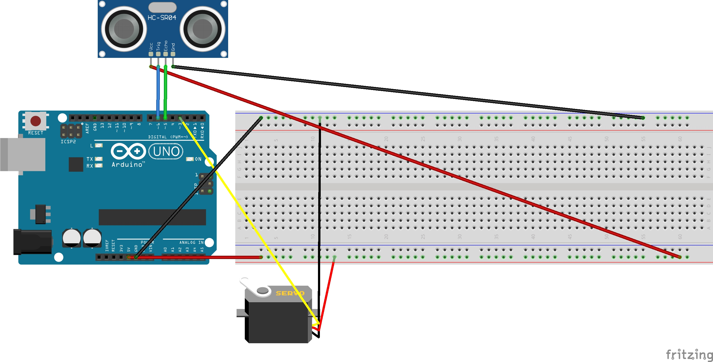

---
## Poubelle-automatique

#### Ce projet permet d'ouvrir automatiquement le couvercle d'une poubelle.
---

---
# vidéo du montage
[](https://drive.google.com/open?id=1xSuzQbIytNH0cMay-oF3Uvymxgk5Ut2z)
---

# Montage


---

# le code arduino

``` c++

#include <Servo.h>
#include <HCSR04.h>

Servo servoMotor;
UltraSonicDistanceSensor distanceSensor (6,5);

void setup() {
  Serial.begin(9600);
  servoMotor.attach(3);

}

void loop() {
  double distance = distanceSensor.measureDistanceCm();
  Serial.println(distance);


if(distance < 30 && distance>0) {
  
  servoMotor.write(80);
  delay (5000);
  } else {
  servoMotor.write(10);
}
}
'''
